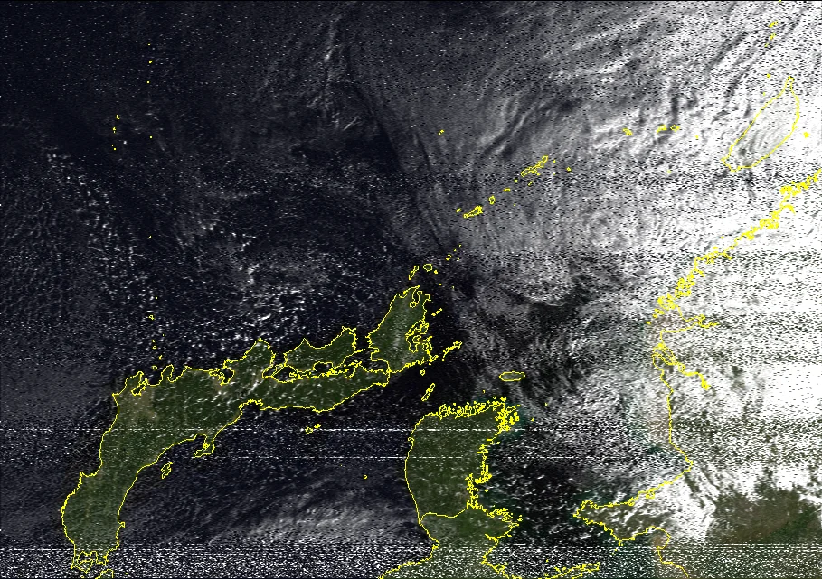

# NOAA Satellite Imagery
This is a documentation of the process that I followed to obtain an image from the NOAA-19 weather satellite.
# Prerequisites
- An RTL-SDR dongle with antenna
- A software defined radio such as GQRX, SDR++, etc.
- An image decoder, I recommend the NOAA-APT Image Decoder from https://noaa-apt.mbernardi.com.ar/
# Step 1: Scoping out the satellite
To begin, you will need to find out when a NOAA satellite will pass by, it doesn't have to be extremely close, you can identify the flyover time of any NOAA satellite from the website https://www.n2yo.com which shows you live tracking. Once you have obtained the information about when it is coming, you are ready to move onto the next step. 
# Step 2: Preparing for recording
You should start preparing 20 minutes before the passover begins. The ideal time of day is early morning or dusk, but you can still get a good quality picture from any time of day as long as the weather is relatively clear. You will need to set up your antennas and set the mode to wide-fm, the range that NOAA satellites operate vary between 137.1 to 137.91 Mhz. Press the play button on your Software Defined Radio to begin the input stream, then move onto the next step.
# Step 3: Capturing the data
As the flyover begins, you should begin to notice the blue coloured stream begin to create an orange and yellow strip, this is where you begin the recording by pressing record on the Software Defined Radio and tune the filter to fit the width of the strip. You are now capturing the data being sent to your antennas from NOAA. After the signal gets weaker and it starts to turn blue again, you can stop the recording. Your radio software should save the capture to a .wav file that we can use for decoding.
# Step 4: Decoding
With your .wav file, open NOAA-APT Image Decoder (or any other image decoding software you have), and select your file. Then after it decodes the images from the file, you should have several .png or image formatted files, you can view them and filter whats shown in the image decoder.
# Step 5: Result
You should now have satellite imagery from NOAA! If the image does not appear to look correct, or looks very grainy, it could have been that the capture was not clear enough or the recording was corrupted.
Here is a picture of South Korea and Southern Japan captured by me by following this process:

